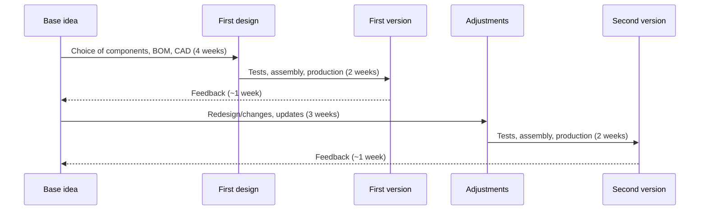
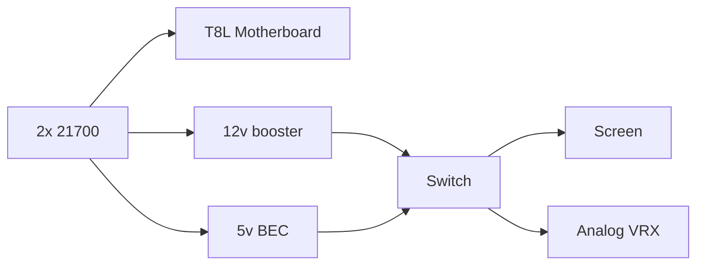

# Radiomaster T8L Analog Mod

## The goal
*Have you ever wanted to have an analog screen built into you fpv radio ?*

Thats what we want to do without the hassle of designing a whole radio.

This project is based around the Radiomaster T8L.

## Our discord server
https://discord.gg/dHFfaPaWNn

## The roadmap
*The roadmap is right now made for the two first versions but may change/update depending of the progress.*

## Wiring diagram
*This is the current version's wiring diagram.*

## Bill Of Material (BOM)
*The current BOM for this build is:*
- Radiomaster T8L
- 4/3" AV in display
- 12v booster
- 2x 18650 or 2x 21700 battery
- Switch to turn on/off the screen
- 5v BEC
- Analog VRX of your choice
